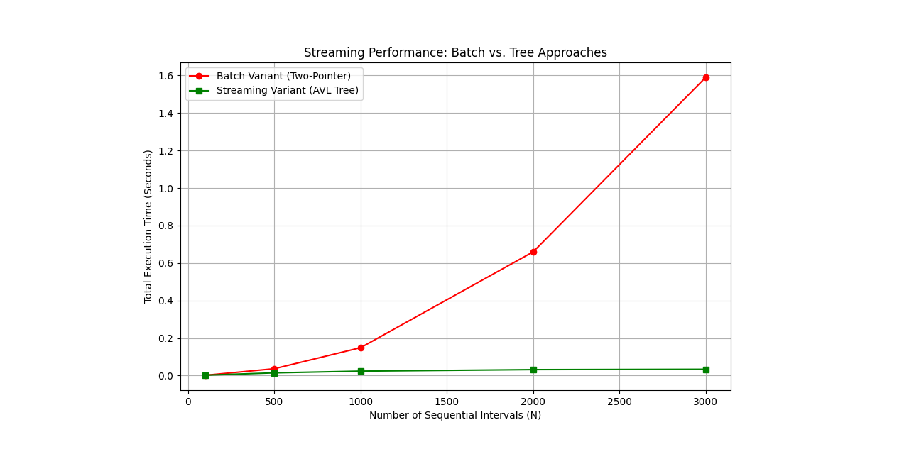

# Data Streaming Accelerators

[](https://achekery.github.io/data-streaming-accelerators/)
[](LICENSE)
[]()

**[🚀 Read the Live Documentation Site Here](https://achekery.github.io/data-streaming-accelerators/)**

## 1. Project Vision "Correctness by Design"
This repository is a deep dive into **high-performance systems primitives for planetary-scale data ingestion**. To ensure **invariant reliability**, these primitives are analyzed with usage scenario diagrams, documented with API contract details, and protected with input validation guards. To ensure **code correctness**, each primitive is implemented as a standalone module and these modules are verified with functional testing and validated with performance benchmarks using automated CI workflows.

## 2. Module Highlights "Dynamic Interval Management"
The Dynamic Interval Management module addresses the **"Efficiency Paradox"** of a complex real-time streaming variant (**Augmented AVL Tree**) having worse performance in offline scenarios, yet better performance in online scenarios compared to a simple batch processing variant (Two-Pointer Search).



My Augmented AVL Tree approach achieves a **verified 50.6x speedup** in online scenarios ($N$=3000) compared to the Two-Pointer Search approach by using $O(\log N)$ history insertion, instead of $O(N \cdot \log N)$ history sorting. It incorporates **sentinel node architecture**. My Augmented AVL Tree approach addresses **architectural hardening** by incorporating a **sentinel node architecture** for AVL balancing (metadata, rotation) that simplifies system-wide invariants and improve code maintainability.

For more information: **[👉 Read the Live Documentation Site Here](https://achekery.github.io/data-streaming-accelerators/)**

## 3. Getting Started
This suite requires **Python 3.13+** for package users.

```
# (Option 1) Install package to current environment
pip install git+https://github.com/achekery/data-streaming-accelerators.git@main

# (Option 2) Add to uv project
uv add git+https://github.com/achekery/data-streaming-accelerators.git@main

# (Option 3) Add to poetry project
poetry add git+https://github.com/achekery/data-streaming-accelerators.git@main
```

It also requires **uv** for package maintainers.

```
# Download source to local folder
git clone https://github.com/achekery/data-streaming-accelerators.git
cd data-streaming-accelerators

# Run tests with uv pytest
uv run --group dev --extra benchmark pytest -sv
```
