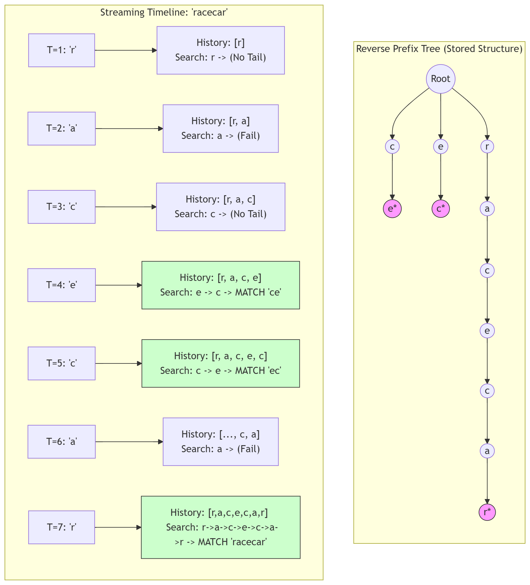

# Suffix Pattern Recognition

## 1. Design Summary
For suffix pattern recognition with $K$ suffix patterns (length $W$) and 1 query pattern (length $N$), using **reverse-traversal prefix tree search** is efficient because it can model common ancestor ordering with reverse encoding (by inserting suffix patterns in reverse order during setup and searching in reverse order during queries) and check the multiple patterns over a single root-to-leaf pass (taking runtime $O(K\*W)$ for one-time setup and $O(W)$ for each query). This improves over using direct suffix pattern search which must check the multiple patterns over separate array passes (taking $O(K\*W)$ for each query) or using forward-traversal prefix tree search which cannot model common ancestor ordering and must check the multiple patterns over separate root-to-leaf passes (taking runtime $O(K\*W)$ for one-time setup and $O(K\*W)$ for each query).

For batch data (offline scenario), reading the query pattern from a static array (size $N$) with a reverse iterator takes $O(1)$ auxiliary space. For streaming data (online scenario), reading the query pattern from a history array (size $W$) reconstructed from the stream takes $O(W)$ auxiliary space.

### 📊 Complexity Analysis

| Operation | Direct Search (v1) | Forward-traversal (v2) | Reverse-traversal (v3) | Comparison |
| :--- | :--- | :--- | :--- | :--- |
| **Initial Setup** | $O(1)$ | $O(K\*W)$ | $O(K\*W)$ | v1 is superior |
| **Batch Queries (N)** | $O(K\*W)$ | $O(K\*W)$ | $O(W)$ | v3 is superior |
| **Streaming Queries (1)** | $O(K\*W)$ | $O(K\*W)$ | $O(W)$ | v3 is superior |
| **Space Complexity** | $O(1)$ | $O(K\*W)$ | $O(K\*W)$ | v1 is superior |

### 🚀 Reverse Encoding (Visual)

The advantage of reverse-traversal prefix tree search is that it can check multiple suffix patterns at once, ensuring $O(W)$ query time (and is independent of the suffix pattern count $K$ and the query pattern length $N$). This is possible because of reverse encoding.

## 2. Design Approaches & Trade-offs

### When Less is More
Although Direct Search (v1) requires ~90% less lines of code, it performs worse than Reverse-traversal (v3) in every comparison other than initial setup and space complexity. This trade-off shows that Direct Search may be preferable for low-memory systems that cannot afford higher space usage (like embedded systems) or greater maintenance scope (like regulated industries) and that Reverse-traversal may be preferable for systems with more resources (like compute nodes in distributed systems).

### Python Object-Model Tuning
To reduce object-overhead due to the Python object-model, I implemented a **nested hash map** for the reverse-traversal prefix tree, with each "node" using a character for the hash map key and a reference to the next "node" for the hash map value. This approach reduced object lookup during queries.
