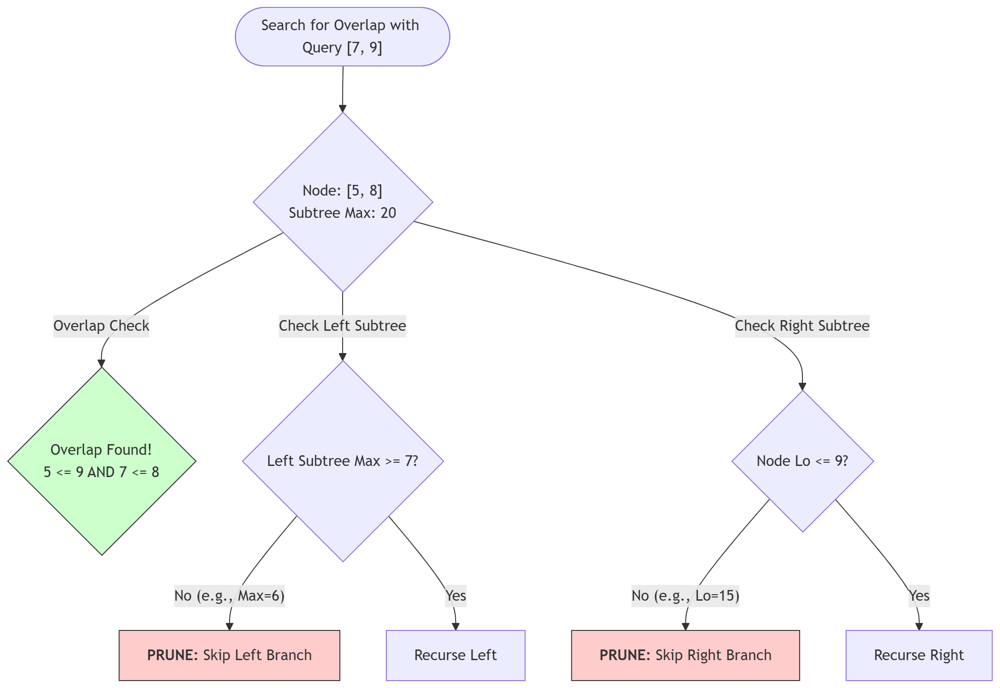

# Dynamic Interval Management

## 1. Design Summary
The theoretical lower bound for merging $N$ static intervals is $\Omega(N \log N)$ due to the sorting requirement. By focusing on interval edges rather than the source intervals themselves, we can focus on efficient algorithms with compact implementation.  However, in **Online Streaming Environments**, the task shifts from batch data loading (static intervals) to streaming data ingestion (dynamic intervals).

### 📊 Complexity Analysis

| Operation | Batch Variants (v1/v2) | Streaming Variant (v3) | Comparison |
| :--- | :--- | :--- | :--- |
| **Initial Setup** | $O(N \log N)$ | $O(N \log N)$ | Equivalent |
| **Batch Updates (N)** | $O(N \log N)$ | $O(N \log N)$ | Equivalent |
| **Streaming Updates (1)** | $O(N \log N)$ | **$O(\log N)$** | **Streaming Variant** is superior |
| **Space Complexity** | $O(N)$ | $O(N)$ | Equivalent |

### 🚀 The Pruning Logic (Visual)

The advantage of an Augmented AVL Interval Tree is its ability to prune search branches that cannot contain an overlap, ensuring $O(\log N)$ search time.



### 🛠 Getting Started

This design requires **Python 3.11+**.

To run the regression tests for this design:
```bash
cd dev && python solution.py
```

## 2. Design Approaches

### Optimal Approaches for Batch Data (Static Intervals)
* **Sweep-line (Variant 1):** Uses a sorted list of edge objects and a counter.
    * **Complexity (Batch):** $O(N \log N)$ setup, $O(N)$ calculation. 
    * **Complexity (Streaming):** $O(N \log N)$ per `insert`/`put` operation.
    * **Verdict:** Suitable for batch case due to second-best ~16ms benchmark with static intervals impacted by object-overhead during calculation. Not suitable for streaming case due to high complexity.
* **Two-Pointer Search (Variant 2):** Uses two sorted edge arrays and two pointers.
    * **Complexity (Batch):** $O(N \log N)$ setup, $O(N)$ calculation.
    * **Complexity (Streaming):** $O(N \log N)$ per `insert`/`put` operation.
    * **Verdict:** Suitable for batch case due to best-in-class ~7ms benchmark with static intervals. Not suitable for streaming case due to high complexity.

### Optimal Approaches for Streaming Data (Dynamic Intervals)
* **Augmented AVL Interval Tree (Variant 3):** A stateful, self-balancing BST.
    * **Complexity (Batch):** $O(N \log N)$ setup, $O(N)$ calculation. 
    * **Complexity (Streaming):** $O(\log N)$ per `insert`/`put` operation.
    * **Verdict:** Not suitable for batch case due to poor ~4130ms benchmark with static intervals impacted by object-overhead during calculation. Suitable for streaming case due to best-in-class complexity per `insert`/`put` operation. Notice the optimal approaches for batch data merging are easier to maintain, with **90% fewer LOC** (~25 vs ~250)! 

## 3. Design Trade-offs

### The Efficiency Paradox
In benchmarks with static intervals, the Two-Pointer Search (Variant 2) was **400x faster** than the Interval Tree (Variant 3). However, in **Online Streaming Environments**, the Two-Pointer Search overall complexity degrades to $O(N^2 \log N)$ over a series of $N$ updates while the Interval Tree overall complexity maintains $O(N \log N)$.

## 4. Design Optimizations

### Node Metadata
By augmenting the BST with `subtree_max` metadata, I reduced the search-and-merge task from a linear scan to a logarithmic search. This allows the streaming platform to maintain a "Live" merged state with $O(\log N)$ latency per request.

### Architectural Hardening
By implementing a **Sentinel Node Architecture** with a **Two-Down** AVL balancing subtree rotation strategy and removing sentinel node checks throughout the codebase, I simplified the balancing feature and provided a cleaner and more maintainable implementation.

### Python Object-Model Tuning
To reduce object-overhead due to the Python object-model, I implemented **Attribute Flattening**. After replacing packed collections (`self.interval[0]`) with discrete integers (`self.lo`, `self.hi`), I reduced constant factors in the hot execution path and achieved a **15% reduction** in benchmarks with static intervals.
