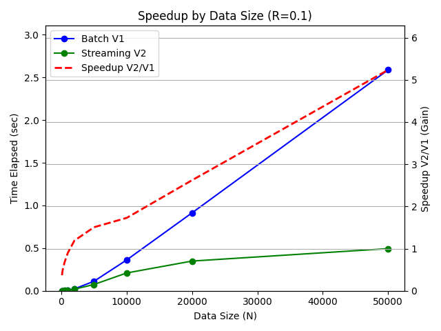
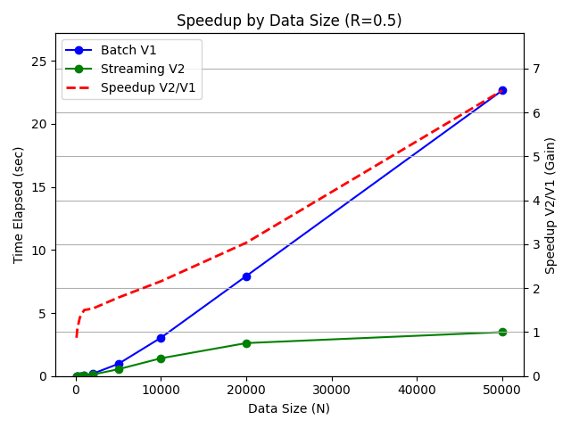

# Dynamic Point Aggregation


## 1. Design Summary
The optimal runtime complexity for dynamic point aggregation from $N$ point values to $O(N)$ disjoint intervals is $\Omega(N \log N)$ due to the ordering requirement. The request handler uses `put` requests to add new values and `get` requests to make a new interval sequence.

Because offline scenarios (batch data) have known usage patterns, the batch variant (V1) can **optimize the hot path** by simplifying high-usage `put` requests to $O(1)$ and expanding low-usage `get` requests to $O(N \log N)$.

However, because online scenarios (streaming data) do not have known usage patterns, the streaming variant (V2) must instead **balance complexity** between `put` requests ($O(\log N)$) and `get` requests ($O(N)$).

### 📊 Complexity Analysis

| Operation | Batch Variant (V1) | Streaming Variant (V2) | Comparison |
| :--- | :--- | :--- | :--- |
| **Initial Setup** | $O(1)$ | $O(1)$ | Equivalent |
| **Batch Updates (N Put, 1 Get)** | $O(N \log N)$ | $O(N \log N)$ | Equivalent |
| **Streaming Updates (N Put, K Get)** | $O(K*N \log N)$ | $O(N \log N + K * N)$ | **V2 is Superior** |
| **Space Complexity** | $O(N)$ | $O(N)$ | Equivalent

## 2. Design Details
The batch variant (V1) uses an unordered set to add new values as data points in $O(1)$ per `put` request and does one pass over a new sorted list with sweep line method to generate disjoint intervals in $O(N \log N)$ per `get` request.

The streaming variant (V2) uses two sorted sets with binary search to add new values as interval bounds in $O(\log N)$ per `put` request (or $O(\sqrt N)$ with python `sortedcontainers`) and does one pass over the existing sorted sets with sweep line method to generate disjoint intervals in $O(N)$ per `get` request.

## 3. Design Trade-offs

### The Efficiency Paradox
Although the batch variant (V1) was **2.7x faster** in small-scale offline scenarios (N=100, R=0.1), the streaming variant (V2) was **6.4x faster** in large-scale online scenarios (N=50000, R=0.5). This performance gain in online scenarios was due to the runtime complexity of the streaming variant at $O(N \log N + K*N)$ increasing more slowly with data size compared to the batch variant at $O(K*N \log N)$.

With python `sortedcontainers`, these runtime complexities were instead $O(N \sqrt N + K*N)$ and $O(K*N \log N)$ respectively. Although the streaming variant was still faster, the performance gain was less dramatic since $O(\sqrt N)$ increases faster than $O(\log N)$.

### Streaming Benchmark Results
When the request traffic was mostly `put` requests (R=0.1) to simulate offline scenarios, the batch variant (V1) was 2.7x faster when data size was smaller (N=100) and the streaming variant was **4.9x faster** when data size was larger (N=50000).



When the request traffic was balanced beween `put` and `get` requests (R=0.5) to simulate online scenarios, the batch variant (V1) was **1.2x faster** when data size was smaller (N=100) and the streaming variant was **6.4x faster** when data size was larger (N=50000).



These results highlight that the batch variant (V1) is suitable for smaller data streams and offline scenarios, whereas the streaming variant (V2) is suitable for larger data streams and online scenarios.

| TestCaseID | DataSize | RequestDistribution | V1TimeElapsed | V2TimeElapsed | SpeedupV1V2 | SpeedupV2V1 |
| :--- | :--- | :--- | :--- | :--- | :--- | :--- |
| 0 | 100 | 0.100 | 0.000 | 0.001 | 2.706 | 0.370 |
| 1 | 100 | 0.200 | 0.000 | 0.001 | 1.998 | 0.500 |
| 2 | 100 | 0.500 | 0.001 | 0.001 | 1.289 | 0.776 |
| 3 | 100 | 0.800 | 0.002 | 0.003 | 1.042 | 0.960 |
| 4 | 200 | 0.100 | 0.001 | 0.001 | 2.115 | 0.473 |
| 5 | 200 | 0.200 | 0.001 | 0.001 | 1.642 | 0.609 |
| 6 | 200 | 0.500 | 0.003 | 0.003 | 1.010 | 0.990 |
| 7 | 200 | 0.800 | 0.013 | 0.010 | 0.821 | 1.218 |
| 8 | 500 | 0.100 | 0.002 | 0.003 | 1.606 | 0.623 |
| 9 | 500 | 0.200 | 0.004 | 0.005 | 1.116 | 0.896 |
| 10 | 500 | 0.500 | 0.020 | 0.016 | 0.816 | 1.226 |
| 11 | 500 | 0.800 | 0.071 | 0.051 | 0.726 | 1.378 |
| 12 | 1000 | 0.100 | 0.008 | 0.009 | 1.059 | 0.944 |
| 13 | 1000 | 0.200 | 0.016 | 0.014 | 0.861 | 1.162 |
| 14 | 1000 | 0.500 | 0.070 | 0.050 | 0.715 | 1.400 |
| 15 | 1000 | 0.800 | 0.273 | 0.186 | 0.680 | 1.471 |
| 16 | 2000 | 0.100 | 0.028 | 0.025 | 0.920 | 1.087 |
| 17 | 2000 | 0.200 | 0.059 | 0.046 | 0.776 | 1.289 |
| 18 | 2000 | 0.500 | 0.236 | 0.159 | 0.671 | 1.489 |
| 19 | 2000 | 0.800 | 1.002 | 0.651 | 0.650 | 1.538 |
| 20 | 5000 | 0.100 | 0.140 | 0.105 | 0.751 | 1.331 |
| 21 | 5000 | 0.200 | 0.326 | 0.216 | 0.663 | 1.509 |
| 22 | 5000 | 0.500 | 1.251 | 0.735 | 0.587 | 1.703 |
| 23 | 5000 | 0.800 | 5.099 | 3.020 | 0.592 | 1.688 |
| 24 | 10000 | 0.100 | 0.466 | 0.266 | 0.572 | 1.748 |
| 25 | 10000 | 0.200 | 1.031 | 0.541 | 0.525 | 1.906 |
| 26 | 10000 | 0.500 | 4.038 | 1.950 | 0.483 | 2.071 |
| 27 | 10000 | 0.800 | 15.824 | 7.414 | 0.469 | 2.134 |
| 28 | 20000 | 0.100 | 1.198 | 0.504 | 0.421 | 2.376 |
| 29 | 20000 | 0.200 | 2.633 | 0.990 | 0.376 | 2.660 |
| 30 | 20000 | 0.500 | 10.557 | 3.617 | 0.343 | 2.919 |
| 31 | 20000 | 0.800 | 42.168 | 14.237 | 0.338 | 2.962 |
| 32 | 50000 | 0.100 | 3.473 | 0.695 | 0.200 | 4.996 |
| 33 | 50000 | 0.200 | 7.765 | 1.349 | 0.174 | 5.757 |
| 34 | 50000 | 0.500 | 30.483 | 4.756 | 0.156 | 6.410 |
| 35 | 50000 | 0.800 | 122.369 | 19.013 | 0.155 | 6.436 |

## 4. Design Optimizations

### State Transitions
To ensure new point values are correctly merged with existing disjoint intervals, I applied **Correctness by Design** by separately handling the 3 overlap cases: the enclosed-by case (early exit if lower and upper bounds at insertion point are already aligned), the adjacent-to case (join with 1 or 2 neighbors if lower and upper bounds at insertion point are adjacent), and the distinct-from case (insert as new lower and upper bounds).

## 3. Getting Started

This design requires **Python 3.11+**.

To run the regression tests for this design:
```bash
cd dynamic_point_aggregation
python -m pip install -r requirements.txt
python dev/solution.py
```
